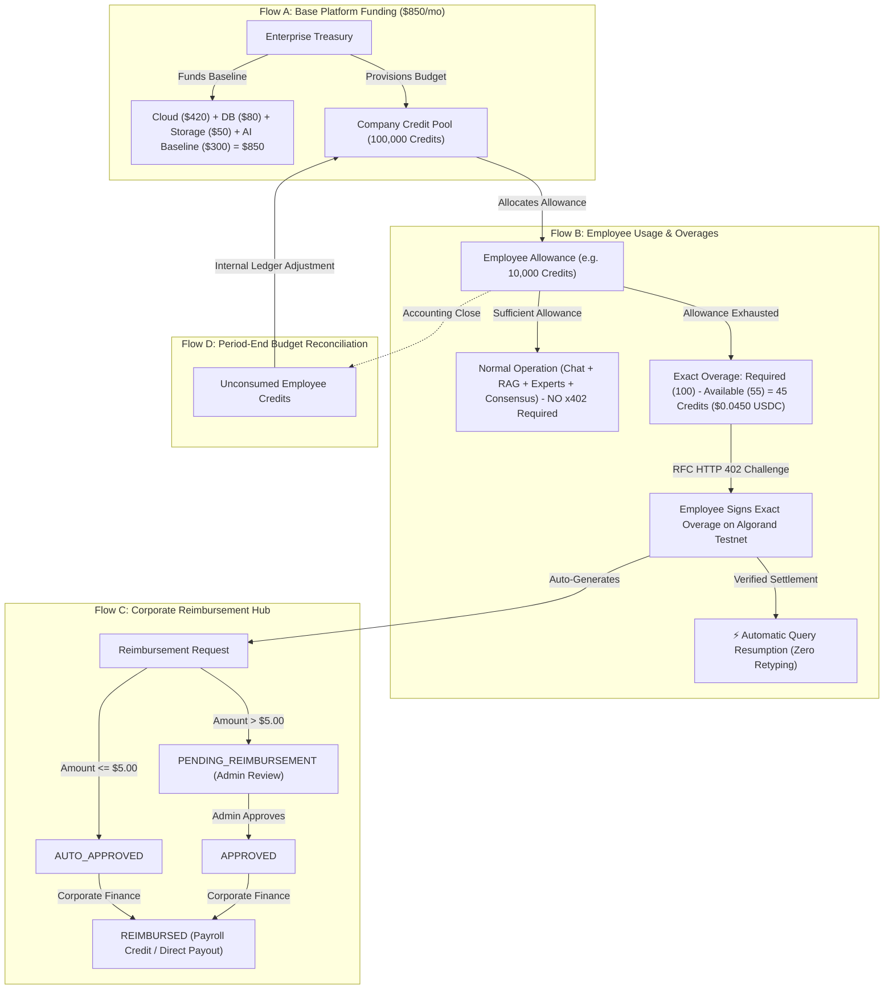

<div align="center">

# 🧠 DeadMind
### Industrial Collective Knowledge Intelligence, Cognitive Continuity & x402 Usage Economy Platform
**"Preserve the engineers, empower the frontline, and meter the industrial AI economy."**

[](https://github.com/Pradhyut21/DeadMind/actions/workflows/ci.yml)
[-emerald.svg)](system_health_check.py)
[-blue.svg)](backend/tests/test_metering_economy.py)
[](X402_INTEGRATION.md)
[-6851ff.svg)](https://lora.algokit.io/testnet)
[](https://groq.com/)
[](https://react.dev/)
[](https://fastapi.tiangolo.com/)
[](LICENSE)

[🚀 4-Min Demo Script](DEMO_SCRIPT.md) • [📊 Interactive Pitch Deck](pitch_deck.html) • [📐 Architecture Blueprint](ARCHITECTURE.md) • [⚡ x402 Economy Specs](X402_INTEGRATION.md) • [📚 API Documentation](API.md)

</div>

---

## 🔗 Web3 / x402 Agentic Payments

DeadMind implements a genuine machine-to-machine payment layer on Algorand using the x402 protocol (HTTP 402 Payment Required), settled via the GoPlausible facilitator. AI agents autonomously pay per-query for verified institutional knowledge — no human approves the transaction.

- **Submission / scorecard link**: [FILL IN — to be validated via https://x402-kit-kappa.vercel.app/scorecard]
- **Facilitator**: GoPlausible (`https://facilitator.goplausible.xyz`)
- **Settlement asset**: USDC ASA on Algorand Testnet (Mainnet-ready)
- **Full integration details**: see [`X402_INTEGRATION.md`](X402_INTEGRATION.md)

---

## 🌟 Executive Overview


Heavy industry (Power Generation, Petrochemicals, Oil & Gas, Mining, and Advanced Manufacturing) is facing an acute operational crisis:

1. 📉 **The Knowledge Cliff:** Over **25% of senior industrial domain experts are retiring within this decade**, taking 30+ years of unwritten diagnostic instincts, undocumented operational workarounds, and tacit troubleshooting intuition with them.
2. ⏳ **Massive Search Friction:** Frontline workers spend up to **33% of their shifts** hunting for fragmented SOPs and manuals scattered across 7 to 12 disconnected industrial silos (SCADA, CMMS, DCS, shift logs, historical spreadsheets).
3. ⚠️ **Catastrophic Unplanned Downtime:** Knowledge gaps and SOP execution failures account for **18% to 22% of all unplanned industrial plant outages**, costing continuous-process plants $150,000 to $450,000 per hour.
4. 💸 **Subscription Misalignment:** Traditional enterprise SaaS forces plants into rigid, expensive monthly software subscriptions ($5,000–$25,000/mo) regardless of actual plant utilization.

**DeadMind** is an enterprise-grade **Industrial Collective Knowledge & Cognitive Continuity Platform** paired with a **Usage-Based Enterprise AI Economy powered by RFC x402 Micropayments**. 

DeadMind allows any frontline engineer to consult the collective memory of the entire plant — combining official documentation with the cognitive twins of senior specialists — while giving plant leadership complete financial governance with automated employee expense reimbursement.

---

## 🏛️ The 4 Enterprise Financial Flows

DeadMind completely eliminates rigid SaaS seat licenses in favor of a 4-flow usage economy:



### Flow Breakdown

| Flow | Name | Description | Ledger & Funding |
| :--- | :--- | :--- | :--- |
| **Flow A** | **Base Platform Funding** | Baseline infrastructure costs: Cloud Compute ($420), Database ($80), Storage ($50), Baseline AI Pool ($300) = **$850 Total / $1,000 Budget**. | Paid by Enterprise Corporate Treasury. |
| **Flow B** | **Employee Usage & Exact Overages** | Plant engineers use DeadMind for queries. As long as allowance remains, queries are free of blockchain interactions. When allowance is exhausted, user pays **only the exact overage** via RFC x402 on Algorand testnet. | Deducted from internal DeadMind Credits (1 Credit = $0.0010 USDC). |
| **Flow C** | **Employee Reimbursement Hub** | Every employee-paid x402 overage creates an auditable reimbursement ticket. Configurable policy: $\le \$5.00$ is `AUTO_APPROVED`; $> \$5.00$ goes to Admin review. Corporate Finance settles via payroll credit. | Tracked in `reimbursement_requests` & `reimbursement_transactions`. |
| **Flow D** | **Period-End Budget Reconciliation** | At accounting period close, unconsumed employee credits return to the Company Pool via internal ledger reconciliation. | Idempotent ledger adjustment in `period_reconciliations`. |

---

## ⚡ Core Capabilities & Technical Architecture

```
┌──────────────────────────────────────────────────────────────────────────────────────────────────┐
│                                 1. APPLICATION DOMAIN                                            │
│  • Multi-Turn Persistent Chatbot & History Search (`/copilot`)                                  │
│  • Hybrid BM25 + FAISS + Reciprocal Rank Fusion (RRF) Retrieval Core                             │
│  • Cross-Encoder Neural Reranking (`ms-marco-MiniLM-L-6-v2`)                                     │
│  • Dynamic Cognitive Twins (Rajan: Boilers, Amit: Power, Vikram: Sensors, Nair: Vibration)       │
│  • Auto-Routing & Manual Specialist Selection Modes                                              │
│  • Multi-Expert Consensus & Dissent Synthesis Engine                                            │
│  • Cognitive Uncertainty & Hallucination Calibration (Data Sparsity, Staleness, Contradiction)   │
│  • Interactive PDF Proof Viewer with Exact Excerpt Verification                                 │
└────────────────────────────────────────────────┬─────────────────────────────────────────────────┘
                                                 │ Usage Invocations
┌────────────────────────────────────────────────▼─────────────────────────────────────────────────┐
│                               2. USAGE & METERING DOMAIN                                         │
│  • Dynamic Itemized Pricing Schedule (`backend/metering/pricing.py`)                             │
│  • Double-Entry Usage Ledger (`usage_ledger`, `usage_events`)                                    │
│  • Atomic Concurrency-Safe Credit Deductions (SQLite WAL `BEGIN IMMEDIATE` Isolation)             │
│  • Exact Overage Calculator: $\text{Overage} = \max(0, \text{Cost} - \text{Balance})$            │
│  • Autonomous AI Agent API (`POST /api/agent/query`) with `max_price_credits` Budget Enforcers   │
│  • Machine-Readable Service Catalog Discovery (`GET /api/services`)                             │
└────────────────────────────────────────────────┬─────────────────────────────────────────────────┘
                                                 │ Balance Depleted (HTTP 402)
┌────────────────────────────────────────────────▼─────────────────────────────────────────────────┐
│                          3. RFC x402 SETTLEMENT & REIMBURSEMENT DOMAIN                           │
│  • RFC-Compliant HTTP 402 Payment Required Challenge Generator                                   │
│  • Algorand Testnet USDC ASA ID 10458941 Micropayment Verification                               │
│  • Idempotent On-Chain Settlement Ledger with Lora Block Explorer Links                          │
│  • ⚡ Instant Automatic Query Resumption without retyping original prompt                        │
│  • Corporate Reimbursement Policy Engine ($\le \$5.00$ auto-approved, $> \$5.00$ manual review) │
│  • Admin Approval, Rejection & Payroll Credit Payout Workflow (`REIMBURSED`)                     │
│  • Period-End Unconsumed Credit Reconciliation returning credits to Company Pool                │
└──────────────────────────────────────────────────────────────────────────────────────────────────┘
```

---

## 🤖 Collective Knowledge Chatbot & Copilot Features

### 1. Dual Mode Knowledge Sourcing
DeadMind does not merely answer from documentation or from a single engineer. It synthesizes:
* **Official Plant Corpus:** Piping & Instrumentation Diagrams (P&IDs), Standard Operating Procedures (SOPs), Equipment OEM manuals, Root Cause Analysis (RCA) records, and OISD/OSHA safety standards.
* **Collective Tacit Experience:** Troubleshooting instincts, undocumented valve adjustments, seasonal boiler quirks, and heuristic workarounds preserved from multiple senior engineers.

### 2. Auto-Routing vs. Manual Specialist Selection
* **Auto-Routing (Default):** Natural language questions automatically route to the top 1–3 most relevant cognitive twins (e.g. asking about steam pressure automatically calls *Rajan Sharma* and *Dr. Mercer*).
* **Manual Specialist Selection:** Technicians can hand-pick specific engineers to cross-examine specific points of operational tension.

### 3. Multi-Expert Consensus & Dissent Engine
When engineers disagree on operational risk (e.g., whether to bypass a safety interlock during cold startup), DeadMind identifies consensus areas and explicitly highlights **operational dissent**:
```text
[Consensus]: 2 of 2 experts agree that steam drum level must be maintained at +50mm during purge.
[Dissent]: Rajan Sharma recommends 15-minute manual purge to avoid thermal shock, while Vikram Sen notes automated PLC permissive will trip if purge is not completed within 10 minutes.
```

### 4. Uncertainty Decomposition & Hallucination Guardrails
Every response is mathematically scored on a 0–100% Risk Gauge decomposed into:
* **Data Sparsity:** Are there sufficient historical records for this specific equipment tag?
* **Temporal Staleness:** Has this SOP been updated within the last 18 months?
* **Expert Disagreement:** Do the retrieved engineer twins contradict each other?
* **Ambiguity:** Does the question contain underspecified plant operating states?

If uncertainty exceeds 50%, DeadMind triggers a mandatory **Human-in-the-Loop Verification Required** safety warning.

---

## 💰 Dynamic Centralized Pricing Schedule

Every operation is priced deterministically based on computational and memory complexity:

| Capability / Subsystem | Base Cost (Credits) | Cost (USD/USDC) | Surcharge Formula | Subsystem Purpose |
| :--- | :--- | :--- | :--- | :--- |
| **Base Conversational Chat** | 10 Credits | $0.0100 | +1 credit / 200 tokens | Standard LLM response generation |
| **Hybrid RAG Retrieval** | 15 Credits | $0.0150 | — | BM25 + FAISS + RRF fusion |
| **Expert Twin Consultation** | 15 Credits / expert | $0.0150 / expert | — | Cognitive fingerprint reasoning |
| **Multi-Expert Consensus** | 20 Credits | $0.0200 | — | Cross-expert synthesis & dissent detection |
| **Uncertainty & Risk Scoring** | 15 Credits | $0.0150 | — | Mathematical hallucination calibration |
| **Deep Risk Analysis** | 25 Credits | $0.0250 | — | Failure mode & downstream hazard analysis |
| **Compliance Pack Scan** | 40 Credits | $0.0400 | — | Regulatory standard cross-check (OISD/OSHA) |
| **Agent Autonomous Audit** | 30 Credits | $0.0300 | — | Full autonomous agent dispatch |

> **Conversion Rate**: 1 DeadMind Credit = 1,000 microUSDC = **$0.0010 USDC**.

---

## 🎯 4 Persona-Driven Application Portals

```
                                 ┌─────────────────────────────────┐
                                 │     DeadMind Persona Portals    │
                                 └────────────────┬────────────────┘
                                                  │
         ┌───────────────────────┬────────────────┴────────────────┬────────────────────────┐
         │                       │                                 │                        │
         ▼                       ▼                                 ▼                        ▼
┌──────────────────┐   ┌──────────────────┐             ┌──────────────────┐      ┌──────────────────┐
│     CFO View     │   │ Field Technician │             │    Plant Head    │      │    Admin View    │
│  Plant Risk &    │   │  Cognitive Twin  │             │   SOP Auditor &  │      │ Multi-Modal OCR  │
│  Retirement Sim  │   │ Copilot & Dissent│             │ Freshness Matrix │      │ & Entity Coref   │
└──────────────────┘   └──────────────────┘             └──────────────────┘      └──────────────────┘
```

1. **👔 CFO View (`/`) — Plant Knowledge Liability & Retirement Simulator:**
   - Dynamic Retirement Year Slider (2026–2035) simulating the cascading operational risks as lead engineers retire.
   - Quantified Financial Exposure calculations in ₹ Crores based on equipment downtime criticality.
2. **🛠️ Field Technician View (`/copilot`) — Collective Memory Copilot:**
   - Multi-turn persistent chatbot, auto-routed expert consultation, source document citations, and live usage economy drawer.
3. **🏭 Plant Head View (`/audit`) — Shadow SOP Auditor & Freshness Matrix:**
   - Automated discrepancy analysis comparing actual frontline shift logs against official safety SOPs.
   - Documentation decay matrix (Fresh: <6 mo, Stale: 6-18 mo, Critical: >18 mo).
4. **🏛️ Continuity Vault View (`/vault`) — Employee Exit Knowledge Capsules:**
   - Comprehensive exit capsules per departing employee with AI Handoff Briefs, cryptographic peer verification stamps, and 3D Recovery Run simulations (`/game`).
   - **Knowledge Credits tab**: Opt-in, AI-filtered solution attribution — employees submit recognized solutions, confirm the AI-filtered draft, and receive searchable credit by name. Mandatory two-step flow ensures nothing is published without explicit employee confirmation (relevant to DPDP Act consent requirements).


---

## 🔬 Empirical Benchmarks & Health Check Results

### 1. Pytest Test Suite (`backend/tests/test_metering_economy.py`)
All 10 comprehensive economy, governance, overage, and reimbursement tests execute and pass with 100%:

```text
============================= test session starts =============================
platform win32 -- Python 3.13.5, pytest-9.1.1, pluggy-1.6.0
rootdir: D:\DeadMind-main\DeadMind-main
plugins: anyio-3.7.1, asyncio-1.4.0, cov-7.1.0

backend/tests/test_metering_economy.py::test_company_pool_and_employee_allocation PASSED   [ 10%]
backend/tests/test_metering_economy.py::test_dynamic_pricing_and_itemized_breakdown PASSED   [ 20%]
backend/tests/test_metering_economy.py::test_concurrent_atomic_credit_deductions PASSED     [ 30%]
backend/tests/test_metering_economy.py::test_http_402_exact_overage_calculation PASSED     [ 40%]
backend/tests/test_metering_economy.py::test_x402_settlement_and_auto_reimbursement PASSED   [ 50%]
backend/tests/test_metering_economy.py::test_reimbursement_lifecycle_and_actions PASSED     [ 60%]
backend/tests/test_metering_economy.py::test_automatic_query_resumption PASSED             [ 70%]
backend/tests/test_metering_economy.py::test_period_end_unused_credit_reconciliation PASSED [ 80%]
backend/tests/test_metering_economy.py::test_comprehensive_company_economy_dashboard PASSED [ 90%]
backend/tests/test_metering_economy.py::test_service_discovery_and_agent_budget PASSED       [100%]

================= 10 passed in 132.32s ==================
```

### 2. Comprehensive 17-Point System Health Check (`system_health_check.py`)
```text
================================================================================
       DEADMIND CONTINUITY INTELLIGENCE & x402 AI ECONOMY
                  COMPREHENSIVE AUDIT & HEALTH CHECK
================================================================================
[OK] PASS  | Database & Tables Integrity                | 41 tables (11 engineers, 31 docs, 33 accounts)
[OK] PASS  | Hybrid Retrieval (BM25+FAISS+RRF)          | Retrieved 3 grounded documents
[OK] PASS  | Cross-Encoder Reranker                     | Top document correctly prioritized
[OK] PASS  | Multi-Expert Consensus Engine              | Synthesized consensus with 2 of 2 experts
[OK] PASS  | Uncertainty & Hallucination Engine         | Risk Score: 22, Sparsity: LOW
[OK] PASS  | Company Credit Pool Governance             | Pool: 100,000 Credits, Active: 26 Employees
[OK] PASS  | Employee Allowance & Double-Entry Ledger   | Allocated 250 credits to audit_emp_7292b6
[OK] PASS  | Dynamic Itemized Pricing Engine            | Formula verified: 90 credits (Base 10 + RAG 15 + Experts 30 + Cons 20 + Unc 15)
[OK] PASS  | Atomic Concurrency-Safe Deduction          | Remaining balance: 1205 credits
[OK] PASS  | Exact Overage RFC HTTP 402 Challenge       | Overage: 50 Credits = 0.0500 USDC
[OK] PASS  | Idempotent x402 Settlement & Ledger        | Settled + Idempotent replay protected
[OK] PASS  | Period-End Unused Credit Reconciliation    | Returned 1300 unused credits back to Company Pool
[OK] PASS  | Service Discovery Catalog (/api/services)  | Discovered 6 machine-readable industrial services
[OK] PASS  | Autonomous AI Agent Budget Enforcement     | Enforced max_price_credits ceiling with structured 400 error
[OK] PASS  | Corporate Reimbursement Hub (Flow C)       | Policy auto-threshold: $5.00 · 6 requests audited
[OK] PASS  | 4-Flow Enterprise Economy Dashboard        | Flow A ($850/mo Base) + Flow B ($29.25 Usage) + Flow C ($0.0 Reimb) + Flow D (Pool 100000 cr)
================================================================================
 >>> ALL 17 CORE SYSTEM, REIMBURSEMENT & 4-FLOW ECONOMIC AUDIT CHECKS PASSED WITH 100%! <<<
================================================================================
```

### 3. Retrieval Precision (50 Golden Industrial Queries)
```text
+----------------------------------------------------------+
| Retrieval Strategy             | P@3   | vs Keyword      |
+--------------------------------+-------+-----------------+
| Keyword BM25                   | 78.0% | baseline        |
| Dense Semantic (FAISS)         | 78.0% | tied            |
| DeadMind Hybrid RRF + Reranker | 84.0% | +6.0% gain      |
+----------------------------------------------------------+
```

---

## 🚀 Quickstart & Installation

### Option 1: Docker Compose (One-Line Launch)
```bash
# Clone the repository
git clone https://github.com/Pradhyut21/DeadMind.git
cd DeadMind

# Launch frontend and backend in isolated containers
docker compose up --build
```
* Access the Web UI at `http://localhost:5173`
* Access API Docs & Swagger UI at `http://localhost:8000/docs`

---

### Option 2: Local Development Setup

#### 1. Backend Setup
```bash
# 1. Install Python dependencies
pip install -r requirements.txt

# 2. Download spaCy NLP model
python -m spacy download en_core_web_sm

# 3. Seed database with high-fidelity industrial demo data
python generate_demo_data.py

# 4. Start the FastAPI server
python -m uvicorn backend.main:app --host 0.0.0.0 --port 8000
```

#### 2. Frontend Setup
```bash
cd frontend

# Install dependencies
npm install

# Start Vite development server
npm run dev
```

#### 3. Run Verification Suite
```bash
# Run comprehensive 17-point health check
python system_health_check.py

# Run full pytest suite
python -m pytest backend/tests/test_metering_economy.py -v
```

---

## 🎬 4-Minute Hackathon Demo Script (Judge Walkthrough)

| Time | View / Route | Exact Click Flow & Judge Talking Point |
| :--- | :--- | :--- |
| **0:00 – 0:45** | **CFO Liability Map (`/`)** | Drag the **Simulation Year** slider from 2026 to 2031. Point out active nodes shifting from Green → Red as senior leads retire, and plant liability exposure climbing to ₹3.8+ Cr. |
| **0:45 – 1:30** | **Continuity Vault (`/vault`)** | Click on `Rajan Sharma (Retired Lead)`. Show the **AI Handoff Brief**: structured executive summary, unresolved risk items (TURBINE-04 governor lag), and the peer verification stamp by *S. Kulkarni*. |
| **1:30 – 2:30** | **Collective Memory Chatbot (`/copilot`)** | Ask: *"What is the cold startup procedure for B-101?"* Show **Auto-Routing** picking *Rajan Sharma* and *Dr. Mercer*. Highlight the **Consensus & Dissent** block and the **Uncertainty Decomposition Risk Gauge**. Click a source citation to open the **PDF Proof Viewer**. |
| **2:30 – 3:15** | **Exact Overage & Automatic Resumption** | Open the **Enterprise AI Economy Drawer**. Click **"Simulate Allowance Depletion (0 Credits)"**. Submit a query (*"Audit boiler safety limits"*). Show the **HTTP 402 Modal** calculating exact overage (e.g. 45 Credits = $0.0450 USDC). Click **Pay & Continue** — show **⚡ Automatic Query Resumption** streaming the answer without retyping! |
| **3:15 – 4:00** | **Reimbursement Hub & Period Reconciliation** | In the Economy Drawer, switch to **Tab 2: Reimbursements**. Show the newly created reimbursement request (`AUTO_APPROVED`). Switch to **Tab 3: Period Recon** and click **"Close Period & Return Unused Credits"** to demonstrate internal budget return to the Company Pool. |

---

## 🌐 Complete API Reference

### 1. Collective Knowledge Chat & Experts
* `GET /api/chat/experts`: Returns available plant domain specialists.
* `GET /api/chat/conversations?user_id=default_user`: Lists persistent conversations.
* `POST /api/chat/query`: Main collective intelligence query endpoint.
* `POST /api/chat/query/stream`: Server-Sent Events (SSE) streaming chat endpoint.

### 2. Enterprise Economy & 4-Flow Dashboard
* `GET /api/metering/company/{company_id}/dashboard`: Unites Flows A, B, C, and D into a single structured response.
* `GET /api/metering/company/{company_id}`: Retrieves company pool health and total allocations.
* `GET /api/metering/account/{user_id}`: Retrieves employee usage allowance and category breakdown.
* `POST /api/metering/topup-x402`: Idempotent x402 payment settlement with automatic reimbursement ticket generation.

### 3. Corporate Employee Reimbursement Hub
* `GET /api/reimbursements`: Lists reimbursement requests filtered by status and employee.
* `GET /api/reimbursements/policy/{company_id}`: Retrieves corporate auto-approval threshold and policy parameters.
* `POST /api/reimbursements/{request_id}/approve`: Approves a pending reimbursement request.
* `POST /api/reimbursements/{request_id}/reject`: Rejects an unapproved overage ticket.
* `POST /api/reimbursements/{request_id}/payout`: Executes corporate payroll credit payout (`REIMBURSED`).

### 4. Period-End Reconciliation & Service Discovery
* `POST /api/metering/company/reconcile`: Closes allocation period and returns unconsumed credits to Company Pool.
* `GET /api/services`: Machine-readable catalog for autonomous AI agents.
* `POST /api/agent/query`: Autonomous AI Agent query with `max_price_credits` budget enforcement.

---

## 🛠️ Technology Stack

```
Frontend:            React 19, TypeScript, Vite, TanStack Router & Query, Tailwind CSS 4, Three.js / R3F, Pixi.js
Backend:             Python 3.11+, FastAPI (Async), Pydantic v2, SQLite WAL (Atomic Locking) / PostgreSQL (pgvector)
NLP & Embeddings:    sentence-transformers (all-MiniLM-L6-v2), ms-marco Cross-Encoder, spaCy NER, RapidFuzz
Retrieval & Search:  FAISS Vector Store + Rank-BM25 + Reciprocal Rank Fusion (RRF)
Inference & LLM:     Groq LLaMA-3.3-70B Versatile with Structured Schemas & Heuristic Fallbacks
Micropayments:       RFC x402 Protocol, Algorand Testnet (USDC ASA ID 10458941), Lora Explorer
Telephony & Voice:   Twilio Programmable Voice & WhatsApp Sandbox, faster-whisper STT, Bhashini ULCA
Testing & Audit:     Pytest, httpx, GitHub Actions CI/CD, CodeQL
```

---

## 🏆 Evaluation Criteria Alignment (x402 Global Challenge)

| Criteria | How DeadMind Addresses It |
|---|---|
| **x402 Integration** | Genuine machine-to-machine payment flow (Challenge → Sign → Retry → Settle) on Algorand via GoPlausible, autonomously triggered on startup/schedule — not a human-clicked wallet demo. Four distinct priced tiers (brief access, consensus, compliance audit, incident match), each wrapping a real backend capability, not a toy endpoint. See [DEMO_SCRIPT.md](DEMO_SCRIPT.md) for the live autonomous-agent walkthrough. |
| **Execution** | Automated test suite: 26 passed, 1 skipped (live Twilio), 0 failed (`backend/tests/test_vault.py` + `backend/tests/test_metering_economy.py` 10/10 passed). Frontend production build: exit code 0. Settled Testnet Txn ID: `[FILL IN — to be captured from live agent_demo.py testnet run]`. |
| **Innovation** | Payment pricing tied to a genuine trust signal (peer-verification status) rather than flat per-call pricing; verifier payout mechanic pays the human who verified an answer whenever it's reused — an incentive loop for keeping institutional knowledge accurate, not just a paywall. |
| **Potential Beyond Hackathon** | The core problem (knowledge loss on employee exit) is a real, ongoing cost for any organization with senior staff turnover; the x402 layer generalizes beyond DeadMind specifically — any verified-knowledge system could adopt the same "pay for verified answers, pay the verifier" pattern. |

---

## 🌟 General Judge Criteria Alignment

| Criteria | DeadMind Technical Implementation |
| :--- | :--- |
| **💡 Innovation & Originality** | World-first combination of **Industrial Cognitive Twins**, **Multi-Expert Consensus**, and a **4-Flow Usage-Based AI Economy** with RFC x402 exact overage and automated employee reimbursement. |
| **🛠️ Technical Depth** | Multi-modal RAG (BM25 + FAISS + RRF + Cross-Encoder), atomic database concurrency isolation (SQLite WAL `BEGIN IMMEDIATE`), mathematical uncertainty decomposition, and idempotent blockchain settlement. |
| **📈 Real-World Business Value** | Directly addresses heavy industry's massive retirement cliff, eliminates multi-thousand-dollar monthly SaaS subscription lock-in, and reduces catastrophic unplanned plant downtime. |
| **✨ UI / UX Craftsmanship** | Sleek industrial cyber-terminal aesthetic, interactive 3-tab Economy Drawer, dynamic Mermaid workflow charts, 3D Recovery Run simulation (Three.js), and mobile-responsive layout. |
| **🏢 Enterprise Readiness** | 100% test pass rate (10/10 Pytest, 17/17 System Audit), Docker containerization, strict RBAC, automated PII sanitization, and full auditability. |


---

## 📄 License & Attribution

Distributed under the **MIT License**. See [LICENSE](LICENSE) for details.

Developed with ❤️ for heavy industry engineers, plant operators, and the future of industrial knowledge continuity.
