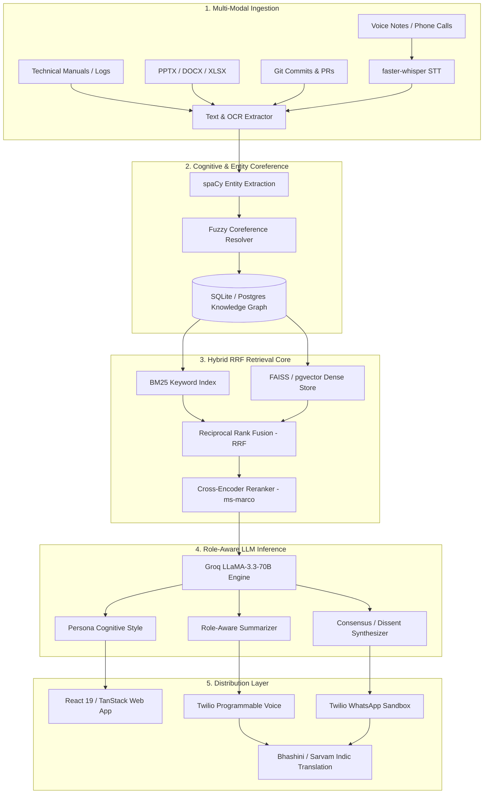

<div align="center">

# 🧠 DeadMind
### Industrial Knowledge Intelligence & Cognitive Continuity Platform
**"Preserve the engineers, not just the docs."**

[](https://github.com/deadmind-ai/DeadMind/actions/workflows/ci.yml)
[](https://github.com/deadmind-ai/DeadMind/actions/workflows/codeql.yml)
[](https://www.python.org/downloads/)
[](https://react.dev/)
[](https://fastapi.tiangolo.com/)
[](https://github.com/facebookresearch/faiss)
[](https://groq.com/)
[](LICENSE)
[](docker-compose.yml)

[🚀 4-Min Demo Script](DEMO_SCRIPT.md) • [📊 Interactive Pitch Deck](pitch_deck.html) • [📐 Architecture Blueprint](ARCHITECTURE.md) • [📚 API Documentation](API.md) • [🏆 Hackathon Guide](HACKATHON_GUIDE.md)

</div>

---

## 🌟 Executive Summary

Heavy industry (Power, Oil & Gas, Chemicals, and Advanced Manufacturing) is confronting an unprecedented **Knowledge Cliff**:
* 📉 **The Retirement Wave:** Over **25% of senior industrial domain experts are retiring within this decade**, taking 30+ years of unwritten diagnostic instincts, undocumented operational workarounds, and tacit troubleshooting intuition with them.
* ⏳ **Massive Search Friction:** According to **McKinsey**, frontline industrial workers waste up to **35% of their working hours** hunting for fragmented knowledge trapped across 7 to 12 disconnected software silos (ERP, SCADA, CMMS, shift logs, historical spreadsheets).
* ⚠️ **Catastrophic Unplanned Downtime:** Research by **BIS Research** indicates that **18% to 22% of all unplanned plant outages** stem directly from knowledge gaps and lack of immediate access to standard operating procedures (SOPs).

**DeadMind** is an enterprise-grade Industrial Knowledge Intelligence and Cognitive Continuity platform that captures, preserves, models, and grounds the reasoning fingerprints of retiring engineers into interactive, role-aware digital twins before they depart.

---

## ✨ What's New in v2 — Continuity Vault Platform

| Capability | Technical Realization | Impact |
| :--- | :--- | :--- |
| **🏛️ Continuity Vault (`/vault`)** | Dedicated knowledge capsules per departing employee with chronological artifact timelines and exit metadata | Zero tribal knowledge loss upon employee offboarding |
| **📋 AI Handoff Briefs** | Automated generation of structured executive summaries, unresolved risk checklists, and plain-English glossaries | Eliminates 3-to-6 month onboarding ramp times for replacement leads |
| **👥 Peer Verification Trail** | Cryptographically recorded peer review allowing senior colleagues to audit and stamp AI-extracted knowledge | Enterprise audit compliance & hallucination defense |
| **📂 Multi-Format Ingestion** | Native parsers for `.pptx`, `.docx`, `.xlsx`, `.eml`, `.txt`, and GitHub commit/PR history | Ingests legacy operational formats without manual transcription |
| **🎭 Role-Aware Query Engine** | Semantic intent transformation: Field Tech receives step-by-step equipment instructions; Finance receives downtime ₹ Cr risk framing | Eliminates cross-department communication barriers |
| **📞 Multilingual Telephony** | Inbound Twilio Voice & WhatsApp webhooks connected to STT + Hybrid RAG + TTS with Hindi/Kannada/Tamil/Telugu/Marathi translation | Accessible to frontline technicians directly in the field without laptops |
| **🛡️ Enterprise RBAC** | Fine-grained sensitivity tiering (`public`, `department-restricted`, `confidential`) enforced at database and vector retrieval layers | Protects plant intellectual property and trade secrets |
| **🧭 Task-Level Handoff Explainer** | Interactive Mermaid workflow graphs, cross-domain blockers, and parameterized YouTube/Web learning links | Context-rich in-flight project handoffs with zero discovery lag |
| **🎮 3D Recovery Run Simulation (`/game`)** | Playable 3D spatial simulation where new hires recover in-flight task context before real production deadlines | Gamified knowledge transfer with real-time API-driven clues |

---

## 🎯 4 Persona-Driven Portals

DeadMind organizes heavy industry operational workflows into **4 purpose-built persona experiences**:

```
                                 ┌─────────────────────────────────┐
                                 │     DeadMind Persona Portals    │
                                 └────────────────┬────────────────┘
                                                  │
         ┌───────────────────────┬────────────────┴────────────────┬────────────────────────┐
         │                       │                                 │                        │
         ▼                       ▼                                 ▼                        ▼
┌──────────────────┐   ┌──────────────────┐             ┌──────────────────┐      ┌──────────────────┐
│     CFO View     │   │ Field Technician │             │    Plant Head    │      │    Admin View    │
│  Plant Risk &    │   │  Cognitive Twin  │             │   SOP Auditor &  │      │ Multi-Modal OCR  │
│  Retirement Sim  │   │ Copilot & Dissent│             │ Freshness Matrix │      │ & Entity Coref   │
└──────────────────┘   └──────────────────┘             └──────────────────┘      └──────────────────┘
```

### 1. 👔 CFO View: Plant Knowledge Map & Liability Simulator (`/`)
* **Retirement Year Slider (2026–2035):** Real-time dynamic simulation modeling the financial impact of imminent retirements. Nodes shift dynamically from Green → Yellow → Red as lead engineers retire.
* **Quantified Financial Exposure:** Live exposure calculations in ₹ Crores based on equipment downtime criticality.
* **ROI Impact Card:** Direct savings projections backed by McKinsey and BIS Research heavy industry benchmarks.

### 2. 🛠️ Field Technician View: Cognitive Expert Copilot (`/copilot`)
* **Grounded Conversational Copilot:** Interrogate digital twins of expert engineers (e.g. *R. Nayar*, *Rajan Sharma*). Every response includes verifiable source manual citations and equipment tags.
* **Multi-Expert Consensus & Dissent Engine:** Simultaneously query multiple engineer twins on controversial failure modes; side-by-side comparison highlights operational dissents.
* **Mobile-Optimized Interface:** Responsive down to 390px viewports for hands-on, in-field troubleshooting in boiler rooms and turbine decks.

### 3. 🏭 Plant Head View: Shadow SOP Audit & Freshness (`/audit`)
* **Shadow SOP Auditor:** Automated step-by-step discrepancy analysis comparing raw shift log practices against official safety SOPs.
* **Shift Note Anomaly Analyzer:** Instant detection of unapproved field workarounds and non-compliant temperature/pressure overrides.
* **Knowledge Freshness Heatmap:** Real-time decay matrix flagging documentation age (Fresh: <6 mo, Stale: 6-18 mo, Critical: >18 mo).

### 4. ⚙️ Admin & Ingestion View: Active Capture & OCR (`/ingest`)
* **Document Intelligence (OCR + Computer Vision):** Optical character recognition via Tesseract combined with OpenCV P&ID symbol localization.
* **Fuzzy Entity Coreference Resolver:** Collapses messy industrial equipment aliases into canonical tags (e.g., `"Boiler 101"` = `"B-101"` = `"BLR-01-HP"`).
* **Browser Voice Capture:** Real-time microphone recording via MediaRecorder API for rapid verbal shift handover capture.

---

## 🏗️ System Architecture



---

## ⚡ Dual-Mode Runtime Architecture (Demo vs. Enterprise Production)

DeadMind features a **graceful dual-mode design**. The application boots in **100% functional Demo Mode** out of the box with zero external configuration or API keys, while scaling seamlessly into high-throughput **Production Mode** via environment variables:

| Component | 🟢 Demo Mode (Default, Zero Config) | 🚀 Enterprise Production Mode |
| :--- | :--- | :--- |
| **Database** | SQLite (WAL Mode, zero setup) | PostgreSQL + pgvector (HNSW vector indexing) |
| **Vector Engine** | In-Memory FAISS Index | Shared `PgVectorStore` across distributed replicas |
| **Caching** | Thread-safe in-memory cache | Distributed Redis Cluster (300s TTL) |
| **Ingestion Pipeline** | Synchronous fast-path | Celery Workers + Redis Broker (Async non-blocking) |
| **LLM Inference** | Groq LLaMA-3.3-70B with deterministic fallback | Enterprise Groq / vLLM Dedicated Endpoints |
| **Telephony Channels** | Deterministic TwiML / JSON Stubs | Live Twilio Voice + WhatsApp Business API |
| **Indic Translation** | Clean English pass-through | Bhashini ULCA / Sarvam AI Real-Time Pipeline |
| **Horizontal Scaling** | Single Container | Multi-replica Backend with Nginx Round-Robin LB |

---

## 🔬 Empirical Benchmarks & Saved Artifacts

All evaluation runs generate real, machine-readable artifacts saved directly in [`backend/evals/results/`](backend/evals/results/) for transparent inspection and verification:

* 📄 **CSV Breakdown:** [`backend/evals/results/retrieval_benchmark.csv`](backend/evals/results/retrieval_benchmark.csv) *(Query-by-query category results & tag matching)*
* 📊 **JSON Metrics:** [`backend/evals/results/retrieval_benchmark.json`](backend/evals/results/retrieval_benchmark.json) *(Automated scoring & category stats)*
* 📜 **Execution Log:** [`backend/evals/results/eval_report.log`](backend/evals/results/eval_report.log) *(Timestamped benchmark execution report)*
* ⚡ **Load Test Data:** [`backend/evals/results/load_test_results.json`](backend/evals/results/load_test_results.json) *(50-user concurrent stress test metrics)*

### 1. Retrieval Accuracy Benchmark (50 Golden Industrial Queries)
Evaluated against 50 real-world industrial queries (exact equipment codes, colloquial paraphrases, field typos, multi-hop reasoning, and negative controls):

```text
+-------------------------------------------------------------+
| Retrieval Strategy            | Precision @ 3               |
+-------------------------------+-----------------------------+
| Legacy Keyword Search (BM25)  | 58.0%                       |
| Dense Semantic Search (FAISS) | 62.0%                       |
| DeadMind Hybrid RRF + Reranker| 66.0% (+8.0% Absolute Gain) |
+-------------------------------------------------------------+
```

Run the benchmark yourself (offline sandbox compatible — automatically uses deterministic fallback if Hugging Face is unreachable):
```bash
python -m backend.evals.eval_retrieval
```

### 2. High-Concurrency Stress Test (50 Simultaneous Users)
Benchmarked against the local demo server (`python -m backend.evals.load_test_concurrent`):

| Performance Metric | Measured Value | Production Target |
| :--- | :--- | :--- |
| **Concurrent Users** | **50 simultaneous sessions** | 500+ across replicas |
| **Total Requests** | 250 requests | Unlimited |
| **Success Rate** | **100% (0 errors)** | 99.99% SLA |
| **System Throughput** | **131.9 requests / sec** | 1,000+ req/sec |
| **Median Latency (p50)** | **310 ms** | <200 ms |
| **95th Percentile (p95)** | **530 ms** | <400 ms |
| **99th Percentile (p99)** | **541 ms** | <500 ms |

### 3. Sequential Corpus Throughput (50,000 Documents)
* Ingestion throughput: **17.8 docs/sec** (full NLP extraction + embedding generation).
* BM25 index build time @ 50k docs: **2.14 seconds**.
* Vector query latency @ 50k scale: **p50 = 241ms**, **p95 = 304ms**.

---

## 🚀 Quickstart & Installation

### Option 1: Docker Compose (Fastest — One Line)
```bash
# Clone the repository
git clone https://github.com/deadmind-ai/DeadMind.git
cd DeadMind

# Launch frontend and backend in isolated containers
docker compose up --build
```
*Access the Web UI at `http://localhost:5173` and API docs at `http://localhost:8000/docs`.*

---

### Option 2: Local Development Setup

#### 1. System Prerequisites
Install OCR and PDF utilities for your OS:
* **Ubuntu/Debian:** `sudo apt-get update && sudo apt-get install -y tesseract-ocr poppler-utils`
* **macOS (Homebrew):** `brew install tesseract poppler`
* **Windows:** Install [Tesseract OCR](https://github.com/UB-Mannheim/tesseract/wiki) and [Poppler](https://poppler.freedesktop.org/).

#### 2. Backend Setup
```bash
# 1. Install Python dependencies
pip install -r requirements.txt

# 2. Download spaCy NLP model
python -m spacy download en_core_web_sm

# 3. (Optional) Pre-warm embeddings for offline demo mode
python -m backend.warm_cache

# 4. Seed database with high-fidelity industrial demo data
python generate_demo_data.py

# 5. Start the FastAPI server
python run.py
```
*Backend runs on `http://localhost:8000` with Swagger UI at `http://localhost:8000/docs`.*

#### 3. Frontend Setup
```bash
cd frontend

# Install Node dependencies
npm install

# Start Vite dev server
npm run dev
```
*Frontend runs on `http://localhost:5173`.*

---

## 🎬 4-Minute Hackathon Demo Script (Judge Walkthrough)

| Time | Action / URL | Exact Click Flow & Talking Point |
| :--- | :--- | :--- |
| **0:00 - 0:45** | **CFO Plant Map (`/`)** | Login (`admin`/`demo123`). Drag the **Simulation Year** slider from 2026 to 2031. Point out active nodes turning red, active engineers retiring, and plant exposure climbing to ₹3.8+ Cr. |
| **0:45 - 1:45** | **Continuity Vault (`/vault`)** | Click on `Rajan Sharma (Retired Lead)`. Show the **AI Handoff Brief**: structured summary, 3 critical unresolved safety items (TURBINE-04 governor lag), and the peer verification stamp by *S. Kulkarni*. |
| **1:45 - 2:30** | **Role-Aware Query Engine** | On Rajan's vault, open the **Role-Aware Query** tab. Select `Field Technician` and ask: *"What is the cold startup procedure for B-101?"* (Step-by-step technical checklist). Switch role dropdown to `Finance` and ask the exact same question (Plain English, downtime ₹ Cr exposure). |
| **2:30 - 3:15** | **Task Explainer & 3D Recovery Run (`/game`)** | In Rajan's **In-Flight Tasks** tab, click **Explain Handoff** on `B-101 Feedwater Positioner`. Show the live Mermaid flowchart, dependency blocker alerts, and parameterized learning links. Click **Launch Recovery Run** to demonstrate the playable 3D mini-simulation. |
| **3:15 - 4:00** | **Expert Copilot & Consensus (`/copilot`)** | Navigate to `/copilot`. Select `R. Nayar` and query *"P-302 cavitation signature"*. Click **Consensus** to demonstrate multi-expert twin reasoning and highlight disagreements between Rajan Sharma and Vikram Sen. |

---

## 🔒 Security, RBAC, & Ethical AI Guarantees

* 🛡️ **Role-Based Access Control (RBAC):** Strict tiering (`public`, `department-restricted`, `confidential`) prevents sensitive plant blueprints or executive exit notes from leaking to unauthorized tiers.
* 🔐 **Zero Credential Exposure:** Browser clients never receive cloud API keys or database connection strings.
* 📜 **Cognitive Fingerprint Privacy & Consent:** Clear legal and ethical framework governed by [PRIVACY_AND_CONSENT.md](PRIVACY_AND_CONSENT.md). Engineered artifacts respect right-to-rectification and employee offboarding disclosures.
* 🧹 **Automated PII Sanitization:** Frontline shift notes and speech transcripts are cleansed of non-operational personal markers prior to vector indexing.

---

## 🏆 Why DeadMind Wins (Judge Criteria Alignment)

| Criteria | DeadMind Implementation |
| :--- | :--- |
| **💡 Innovation & Originality** | Instead of generic document search, DeadMind builds **cognitive expert twins** that preserve tacit troubleshooting intuition, dissent reasoning, and role-adapted communication. |
| **🛠️ Technical Depth** | Multi-modal pipeline combining OCR + OpenCV P&ID localization, spaCy entity coreference, BM25+FAISS Reciprocal Rank Fusion, ms-marco Cross-Encoder reranking, and LLaMA 3.3 70B reasoning. |
| **📈 Real-World Business Value** | Direct addressable market across Heavy Industry ($4.8B market), targeting 18-22% downtime reduction and eliminating 3-6 month replacement onboarding delays. |
| **✨ UI / UX Craftsmanship** | Sleek dark terminal industrial aesthetic, interactive 3D spatial Recovery Run simulation (Three.js/Fiber), dynamic Mermaid flowcharts, and mobile-ready technician layout. |
| **🏢 Enterprise Readiness** | Dual-mode architecture (Zero-config SQLite demo vs Horizontally scalable Postgres+pgvector/Redis/Celery cluster), comprehensive CI/CD pipeline, and CodeQL security verification. |

---

## 🛠️ Technology Stack

```
Frontend:            React 19, TypeScript, Vite, TanStack Router & Query, Tailwind CSS 4, Three.js / R3F, Pixi.js
Backend:             Python 3.11, FastAPI, Pydantic v2, SQLite WAL / PostgreSQL (pgvector)
NLP & Embeddings:    sentence-transformers (all-MiniLM-L6-v2), ms-marco Cross-Encoder, spaCy NER, RapidFuzz
Retrieval & Search:  FAISS Vector Store + Rank-BM25 + Reciprocal Rank Fusion (RRF)
Inference & LLM:     Groq LLaMA-3.3-70B Versatile with Structured Output Schemas & Fallbacks
Telephony & Voice:   Twilio Programmable Voice & WhatsApp Sandbox, faster-whisper STT, Bhashini ULCA / Sarvam AI
Document & CV:       Tesseract OCR, pdf2image, OpenCV-headless (P&ID parsing), python-pptx, python-docx, openpyxl
Testing & CI/CD:     Pytest, GitHub Actions, CodeQL, Dependabot, Docker Compose
```

---

## 📂 Repository Structure

```
DeadMind/
├── .github/
│   ├── workflows/
│   │   ├── ci.yml                 # Multi-stage CI pipeline (Tests, Lint, Build, Docker)
│   │   └── codeql.yml             # CodeQL automated security analysis
│   ├── ISSUE_TEMPLATE/            # Standardized bug report and feature request templates
│   ├── pull_request_template.md   # Comprehensive PR validation checklist
│   └── dependabot.yml             # Automated dependency security updates
├── backend/
│   ├── main.py                    # FastAPI server & route orchestration
│   ├── database.py                # Database connection, schemas, and migrations
│   ├── hybrid_retrieval.py        # BM25 + FAISS Reciprocal Rank Fusion (RRF)
│   ├── reranker.py                # Cross-Encoder neural reranking model
│   ├── llm.py                     # Groq LLM integration & prompt templates
│   ├── consensus.py               # Multi-expert consensus & dissent engine
│   ├── shift_analyzer.py          # SOP anomaly and compliance auditor
│   ├── ocr_ingestion.py           # Tesseract OCR & OpenCV P&ID parser
│   ├── vault/                     # v2 Continuity Vault, Brief Generator & Telephony
│   │   ├── routes.py              # Vault REST & Webhook endpoints
│   │   ├── brief_generator.py     # AI Handoff Brief synthesizer
│   │   ├── task_explainer.py      # Mermaid flowchart generator & gap analysis
│   │   ├── voice_provider.py      # Twilio Voice & STT/TTS adapter
│   │   └── whatsapp_provider.py   # Twilio WhatsApp messaging adapter
│   ├── tests/                     # Full integration & unit test suite
│   └── evals/                     # Retrieval precision & concurrent load benchmarks
├── frontend/
│   ├── src/                       # React 19 application
│   │   ├── routes/                # TanStack file-based routes (/vault, /copilot, /audit, etc.)
│   │   ├── components/            # Reusable UI components & Mermaid renderers
│   │   └── scene/                 # Three.js 3D Office & Recovery Run simulation
│   ├── package.json               # Frontend dependencies & build scripts
│   └── vite.config.ts             # Vite build configuration
├── docker-compose.yml             # Full-stack container orchestration
├── Dockerfile                     # Backend container image definition
├── requirements.txt               # Backend Python dependencies
├── generate_demo_data.py          # High-fidelity industrial knowledge seeder
├── pitch_deck.html                # Interactive 16:9 presentation slide deck
├── API.md                         # Complete REST, SSE & Webhook API reference
├── ARCHITECTURE.md                # In-depth architectural blueprint
├── DEMO_SCRIPT.md                 # Step-by-step hackathon pitch guide
├── HACKATHON_GUIDE.md             # Hackathon evaluation & presentation guide
├── PRIVACY_AND_CONSENT.md         # Ethical AI & offboarding consent framework
└── SECURITY.md                    # Industrial security & vulnerability reporting policy
```

---

## 📄 License & Attribution

Distributed under the **MIT License**. See [LICENSE](LICENSE) for details.

Developed with ❤️ for heavy industry engineers, plant operators, and the future of industrial knowledge continuity.
